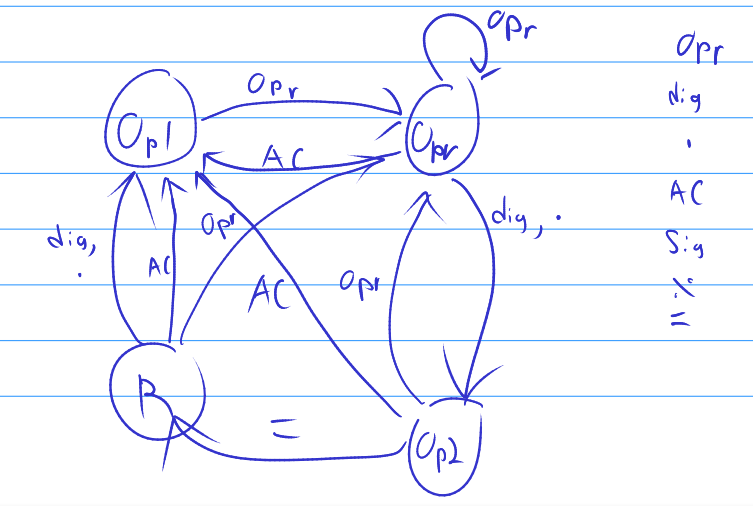

# The Odin Project: Calculator

This is the calculator web application I built for [The Odin Project](https://www.theodinproject.com/)
This app is a showcase of a beginner's proficiencies in Javascript, including some basic Flexbox styling
to render the calculator in a form that at least somewhat resembles a real calculator.

## Design

The calculator is implemented using a Finite State Machine. This is the original sketch I drew during my design process, and I ended up following it to implement the FSM.

The "inputs" to this state machine are "operators" (opr), "digits" (dig), and "equals" (=). 
I drew other inputs to the right of the diagram, but these inputs have no bearing on state transition,
so I did not include them in the diagram.

The calculator was originally designed with a naive collection of conditional statements,
but after reflecting on the design and its shortcomings, I considered my options for refactoring the codebase into something that could scale better and which could be more easily expanded and troubleshooted in the future. The Finite State Machine made sense: a calculator processes simple input characters, but the inputs may behave differently depending on the state; and the state itself is determined by the sequence of inputs presented to the program! This seemed like precisely the problem that the FSM was made to solve.

Ultimately I believe the refactor was a success, but some things still bother me. I've neatly organized and encapsulated the behavior of the states in reaction to the different input, but there are some variables whose values are handled and checked by various functions throughout the program, and I believe they should be managed by the FSM somehow. I may revisit this program in the future and refactor it further in favor of the FSM design model by finding a way to encapsulate these fields within the state objects. Perhaps entry & exit functions would work well?
